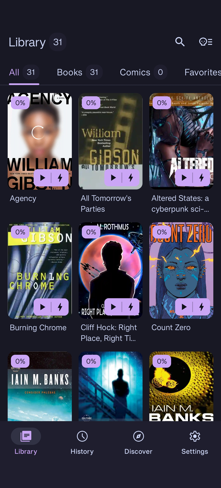
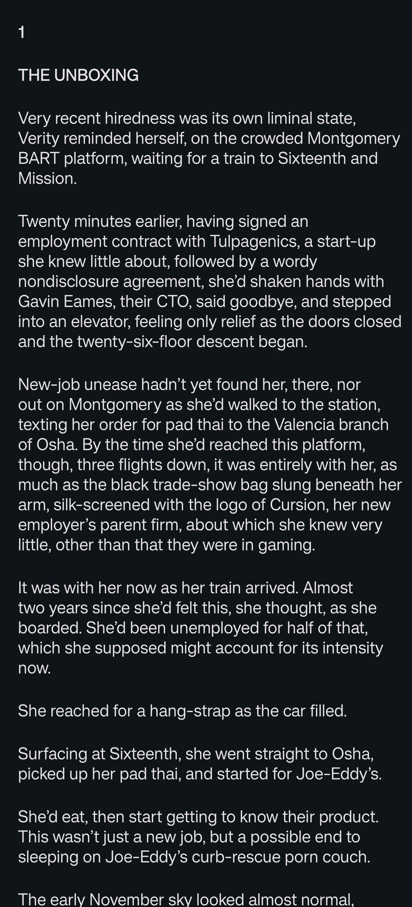
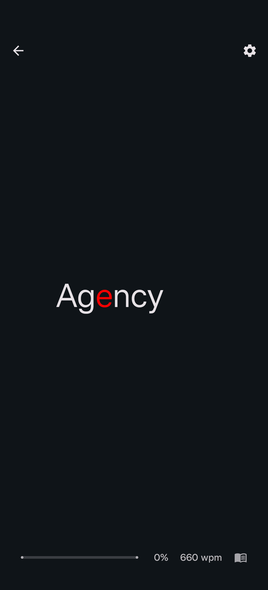
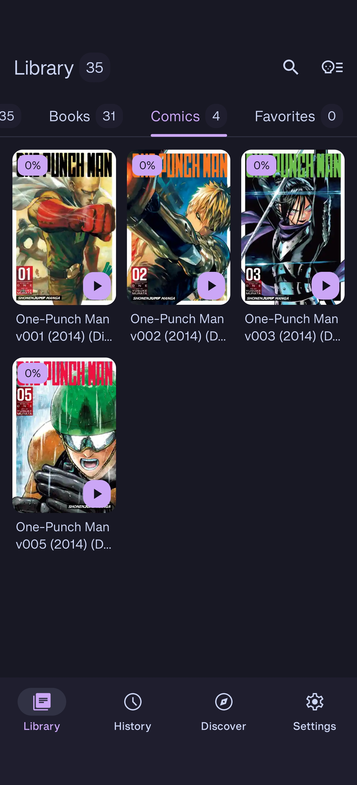
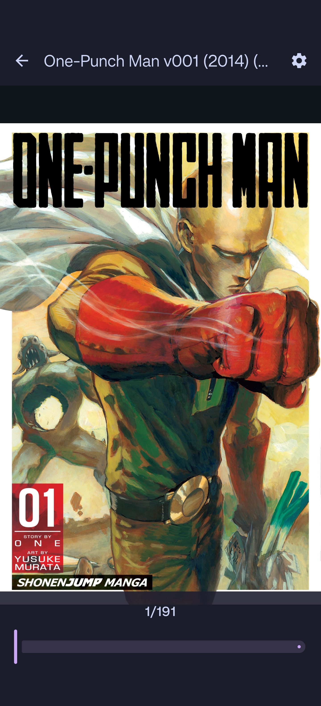
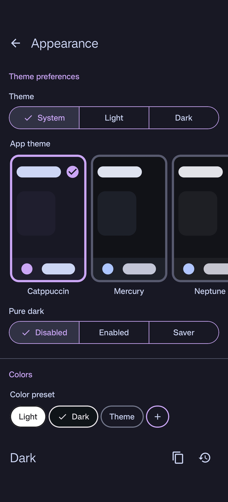

# Codex

### Material You eBook Reader for Android

In the grim darkness of the far future, knowledge is power, and wisdom is forged in battle.  
Codex is an open source, ad-free, Administratum-approved eBook (& dataslate) reader for Android. 

## Gallery
<table>
  <tr>
    <td width="33%">
      
       
    </td>
    <td width="33%">
      
       
    </td>
    <td width="33%">
      
       
    </td>
  </tr>
  <tr>
    <td width="33%">
      
       
    </td>
    <td width="33%">
      
       
    </td>
    <td width="33%">
      
       
    </td>
  </tr>
</table>

## Speed Reader Demo

<video src="https://github.com/BlindMint/codex/releases/download/v2.8.0/speed_reader.mp4" 
       controls 
       width="33%" 
       poster="https://raw.githubusercontent.com/BlindMint/codex/main/docs/images/gallery/speed_reader_screen.jpg">
</video>

 

## Features

- Forge your reading experience with modern Material You design, dynamic themes, custom color presets, and background images
- Supports multiple eBook formats (PDF, TXT, EPUB, FB2, HTML, HTM, MD, FODT)
- Organize your library with categories and advanced search (title, author, description)
- Customize font (yes, even add your own!), text size, padding, reading speed, and more
- Progress tracking, bookmarks with custom names, and in-book text search with highlighting
- Text selection with dictionary lookup and in-app WebView
- Storage Access Framework integration
- Built with Jetpack Compose

## Credits

- [Book's Story](https://github.com/Acclorite/book-story) (GitHub)
- [Tachiyomi (Mihon)](https://github.com/mihonapp/mihon) (GitHub)
- [Kitsune](https://github.com/Drumber/Kitsune) (GitHub)
- [Voyager](https://voyager.adriel.cafe/) (Voyager Website)  
